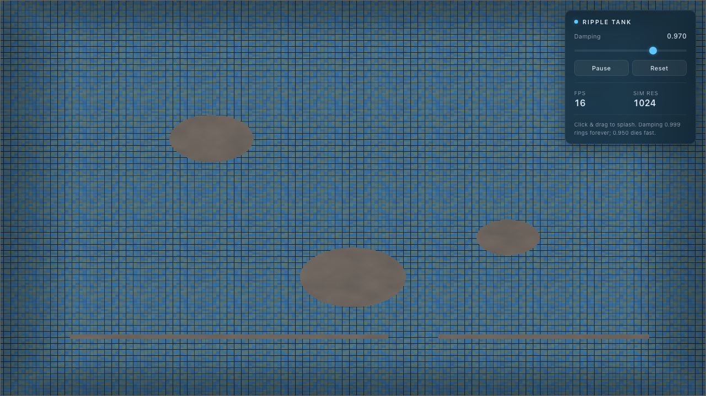

# 🌊 ripple-tank

> WebGL2 기반 물결 파동 간섭(Ripple Tank) 시뮬레이션 — 고해상도 ping-pong height map 알고리즘

마우스로 클릭하는 지점에서 물결이 퍼져나가고, 벽이나 장애물에 부딪히면 반사(Reflection)되며, 두 물결이 만날 때 보강/상쇄 간섭이 일어나는 과정을 고해상도 높이 맵(Height Map) 알고리즘으로 시뮬레이션합니다. 물 밑의 바닥 타일이 굴절되어 보이는 효과까지 리얼하게 구현했습니다.



---

## ✨ 주요 기능

| 기능 | 구현 |
|---|---|
| 클릭으로 물결 발생 | 마우스/터치 + 드래그 강도 스케일링 |
| 장애물 반사 | 3개의 원형 stone + 1개의 벽 (gap 포함) |
| 벽 반사 | 경계 텍스처의 1-texel 외곽 = 캔버스 가장자리 |
| 두 ripple의 간섭 | wave equation의 선형성으로 자연 발생 |
| 고해상도 height map | `RGBA32F` ping-pong 텍스처, 기본 1024×1024 |
| 타일 굴절 | 그라디언트 → 노멀 → UV 변위 + chromatic aberration |
| 반사(specular) | Blinn-Phong, 광원 방향 perturbation |
| 수심 기반 색조 | Beer-Lambert 식 기반 trough=짙은 청색, peak=밝은 청록색 |
| 정지 시 수중감 | 미세 ambient warp + vignette + 푸른빛 바닥 |
| UI | damping 슬라이더, 일시정지, 리셋, FPS, SIM 해상도 |
| 테스트 모드 | `?test=1` (결정론적 baseline), `?res=512\|1024\|2048` |

---

## 🚀 실행 방법 (Quick Start)

### 방법 1 — 그냥 브라우저로 열기 (가장 간단)
```bash
open index.html        # macOS
xdg-open index.html    # Linux
start index.html       # Windows
```

### 방법 2 — 로컬 정적 서버 (권장)
```bash
python3 -m http.server 8000
# → http://localhost:8000
```

### URL 파라미터

| 파라미터 | 효과 |
|---|---|
| `?test=1` | 결정론적 모드 (damping=0.970, ambient warp=0) — 회귀 테스트용 |
| `?res=512` | 시뮬레이션 해상도를 512×512로 낮춤 (저사양 GPU) |
| `?res=2048` | 2048×2048로 높임 (고사양 GPU) |
| `?warp=0` | ambient warp 비활성화 |

기본값은 damping=0.985, sim=1024×1024, warp=0.0015.

---

## 🎮 조작

| 동작 | 효과 |
|---|---|
| **클릭** | 해당 위치에 ripple 발생 |
| **클릭 + 드래그** | 드래그 거리에 비례해 amplitude 1.0× ~ 1.5× 증폭 |
| **Damping 슬라이더** | 0.950 (급속 감쇠) ↔ 0.999 (거의 영구) |
| **Pause 버튼** | 시뮬레이션 정지, 마지막 프레임 유지 |
| **Reset 버튼** | height field 초기화 (장애물은 유지) |

---

## 🧠 동작 원리 (How It Works)

### 1. Wave Equation (Discrete)
```
new_h = (h_left + h_right + h_up + h_down) * 0.5 - h_prev
new_h *= damping
```
이것은 이산화된 2D 파동방정식의 simplest stable form (`r² = 0.5`, CFL 한계). `h_prev` 채널이 텍스처의 G 채널에 저장되어 매 프레임 자연스럽게 시뮬레이션됩니다.

### 2. Ping-Pong 텍스처
- `stateA`, `stateB` 두 개의 `RGBA32F` 텍스처를 번갈아 렌더 타겟으로 사용
- R = 현재 높이, G = 이전 높이
- 한 프레임: `stateA` 읽어서 → `stateB`에 쓰기 → swap
- 다음 프레임: 방금 쓴 `stateB`를 읽음

### 3. 장애물 반사 (Neumann Boundary)
- 별도 `boundaryTex` (R 채널 = obstacle mask)
- 시뮬레이션 셰이더에서 4방향 이웃 샘플 시, 이웃이 obstacle이면 **현재 셀의 높이로 대체** (`mix(neighbor, center, mask)`)
- 이 방식이 자연스러운 반사를 만들어냄 — 브랜칭 없이 컴파일러가 SIMD화 가능
- 외곽 1-texel도 obstacle로 칠해 캔버스 가장자리 반사 처리

### 4. 임펄스 주입 (Method C)
- 클릭 시 Gaussian 임펄스를 `uniform vec4 u_impulses[16]` 으로 셰이더에 전달
- 한 프레임에 최대 16개까지 동시 처리 가능
- 별도 FBO나 blend state 없이 시뮬 패스 안에서 처리

### 5. 굴절 렌더링
```
gradient:  dx = h_right - h_left,  dy = h_up - h_down
normal:    N = normalize(vec3(-dx, 1.0, -dy))
refract:   uv_offset = clamp((dx, dy) * 0.045, ±0.04)
           tile_color = texture(floorTex, baseUV + uv_offset * [1+ca, 1, 1-ca])
specular:  spec = pow(dot(N, H), 80)
tint:      depth_t = clamp(-h * 1.4 + 0.5, 0, 1)
           color = mix(shallow_tint, deep_tint, depth_t) * tile + spec
```
- **Chromatic aberration**: R/G/B 채널을 서로 다른 굴절 오프셋으로 샘플
- **Beer-Lambert 수심**: trough(깊은 물) = 짙은 청색, peak(얕은 물) = 밝은 청록색
- **Edge vignette**: 캔버스 가장자리 어둡게 → 수조 깊이감

### 6. 절차적 타일 바닥
- `TILE_FS` 셰이더가 한 번에 1024² RGBA8 텍스처로 베이크
- warm/cool 랜덤 타일 + grout + bevel highlight + FBM noise

---

## 📂 프로젝트 구조

```
ripple-tank/
├── index.html      # 단일 HTML (HTML + CSS + JS + GLSL 모두 인라인)
├── README.md       # 한국어
└── .gitignore      # oh-my-opencode 내부 상태 제외
```

**외부 의존성: 0개.** CDN 없음, 외부 폰트 없음, 외부 JS/CSS 없음, `fetch`/`import`/`Worker` 없음. `file://` 로 직접 열어도 동작.

---

## 🔬 검증 (Verification)

Playwright headless Chromium으로 7개 시나리오 검증 완료 (모두 PASS):

| ID | 시나리오 | 증거 |
|---|---|---|
| S1 | 페이지 로드 → 캔버스 + 타일 + 장애물 + UI 표시 | 스크린샷 + 콘솔 에러 0개 |
| S2 | 클릭 시 ripple 발생 + 시간에 따라 propagation | `prop-0100ms` → `prop-2500ms` 동심원 패턴 |
| S3 | 장애물 반사 | `reflect-1800ms` 클릭 지점에서 wave 반사 |
| S4 | 두 ripple 간섭 | `interf-800ms` 좌/우 두 wave 동시 존재 |
| S5 | SIM_SIZE = 1024 | state inspector: `simSize: 1024` |
| S6 | 타일 굴절 | `refract-pre` vs `refract-peak` — 타일이 wave 아래에서 휘어짐 |
| S7 | 단일 HTML, `file://` 지원 | `file://` 로드 시 RIPPLE_READY=true |

`window.__ripple_state()` inspector, `window.__ripple_click(u, v)` 등 프로그래매틱 훅으로 자동화 가능.

---

## ⚙️ 튜닝 상수

`index.html` 내 `RENDER_FS` / `SIM_FS` 상단에서 조정 가능:

| 상수 | 기본값 | 의미 |
|---|---|---|
| `u_refractStrength` | 0.045 | 굴절 강도 |
| `u_aberration` | 0.0025 | 색수차 |
| `u_staticWarpAmp` | 0.0015 | 정지 시 ambient warp |
| `u_tileScale` | 14.0 | 타일 개수 / 짧은 변 |
| `damping` (slider) | 0.985 | 감쇠 계수 |
| `click amplitude` | 0.45 | 클릭 impulse 진폭 |
| `SIM_SIZE` | 1024 | 시뮬레이션 텍스처 크기 |

---

## 📜 License

MIT © 2026 sigco3111

---

## 🙏 Acknowledgments

이 프로젝트는 **minimax-M3** 모델과 **OpenCode CLI** 환경에서 생성되었습니다. 프롬프트 엔지니어링과 디자인 결정은 저장소 소유자가 직접 수행했습니다.

- **코딩미션 참조 페이지**: [cokac.com — 코드깎는노인](https://cokac.com/list/announcement/24)
- **Wave equation 참고**: Hugo Elias archive, GPU Gems 2 Ch. 44, mysimulator.uk
- **WebGL ripples 참고**: jquery.ripples, m-ender/webgl-ripples